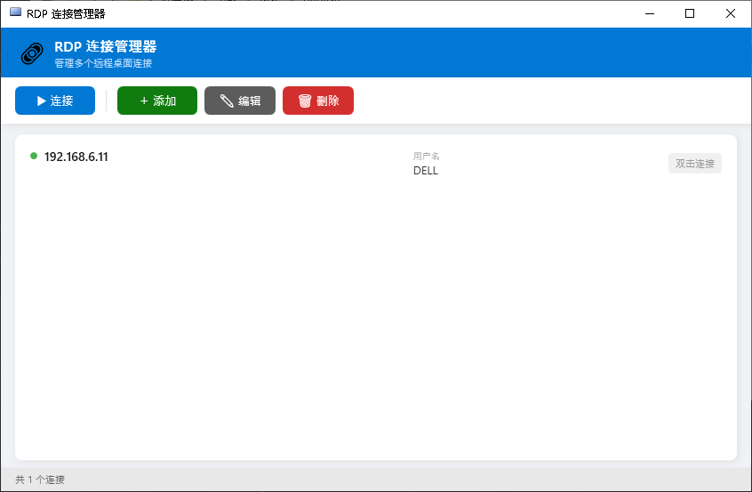
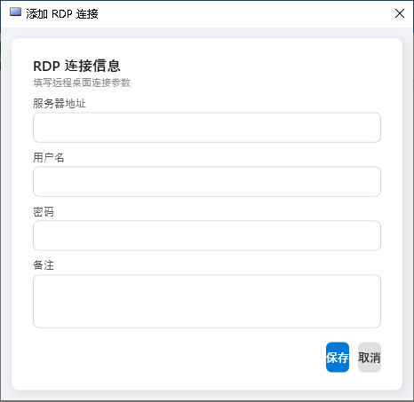

# RDP 连接管理器

Windows 远程桌面连接管理工具，可视化存储和管理多个 RDP 连接，一键启动。

## 截图

| 主界面 | 添加连接 |
|--------|---------|
|  |  |

## 功能

- **连接管理** — 添加 / 编辑 / 删除 RDP 连接（服务器地址、用户名、密码、备注）
- **一键连接** — 选中后点击「连接」或 **双击** 直接启动远程桌面
- **多窗口** — 支持同时打开多个 RDP 连接，互不干扰
- **安全存储** — 密码使用 **Windows DPAPI** 加密，仅当前用户可解密
- **本地数据库** — 数据存储在 SQLite 中，轻量无依赖

## 下载

从 [Releases](https://github.com/orVC/Windows-RDPManager/releases) 获取最新版本。

| 版本 | 文件 | 大小 | 说明 |
|------|------|------|------|
| 自包含版 | `RDPManager_v*_self-contained.zip` | ~55 MB | 解压即用，无需任何运行时 |
| 框架依赖版 | `RDPManager_v*_framework-dependent.zip` | ~0.3 MB | 需安装 [.NET 9 Desktop Runtime](https://dotnet.microsoft.com/zh-cn/download/dotnet/9.0) |

> 支持 Windows 10 1607+ / Windows 11 / Windows Server 2016+
> 不支持 Windows 7 / Windows 8.1

## 使用

1. 运行 `RDPManager.exe`
2. 点击「＋ 添加」，填入服务器信息
3. 选中连接后：
   - 点击「▶ 连接」或 **双击** — 启动远程桌面
   - 点击「✎ 编辑」— 修改连接
   - 点击「🗑 删除」— 移除连接

## 数据存储

```
%LocalAppData%\RDPManager\connections.db
```

密码通过 Windows DPAPI 加密存储，仅当前 Windows 用户可解密。

## 自行构建

```bash
# 框架依赖版
dotnet publish -c Release --self-contained false -p:PublishSingleFile=true -o publish-fd

# 自包含版
dotnet publish -c Release -r win-x64 --self-contained true -p:PublishSingleFile=true -o publish
```

## 说明

> 本项目由 AI（[OpenCode](https://opencode.ai)）辅助开发完成。

## 技术栈

| 层 | 技术 |
|----|------|
| 语言 | C# |
| UI 框架 | WPF (.NET 9) |
| 数据库 | SQLite (Microsoft.Data.Sqlite) |
| 密码加密 | Windows DPAPI (ProtectedData) |
| RDP 启动 | cmdkey + mstsc.exe |
